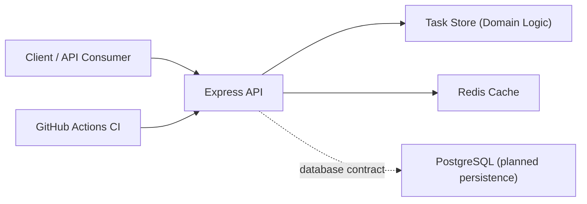

# Cloud-Native Task Management API
Backend portfolio project aligned to ANZSCO 261312 (Developer Programmer).

## Portfolio Context
- Full ANZSCO 261312 portfolio landing page: [projects-workspaces](https://github.com/jen-the-dev/projects-workspaces)
- Application cover letter template: [cover-letter-anzsco-261312.md](https://github.com/jen-the-dev/cicd-automated-infrastructure/blob/main/cover-letter-anzsco-261312.md)
- Related core showcase repositories:
  - [multi-platform-ecommerce-web-app](https://github.com/jen-the-dev/multi-platform-ecommerce-web-app)
  - [realtime-data-streaming-dashboard](https://github.com/jen-the-dev/realtime-data-streaming-dashboard)
  - [cicd-automated-infrastructure](https://github.com/jen-the-dev/cicd-automated-infrastructure)

## Problem
Small teams need a reliable task service with clean API design, predictable status transitions, and fast list queries under repeated reads.

## Solution
This project implements a containerized REST API with:
- task create/list/status-update endpoints,
- health/readiness checks,
- Redis-backed read caching with mutation invalidation,
- CI checks and automated test execution.

## Architecture Diagram

## Tech Stack
- Node.js + Express
- Redis
- PostgreSQL (integration-ready contract)
- Docker Compose
- GitHub Actions

## Setup Instructions
1. `cd api && npm install`
2. `cp .env.example .env`
3. `cd .. && docker compose up --build`
4. Open `http://localhost:4000/health`

## Testing
- Unit and integration tests:
  - `cd api && npm test`
- Static syntax check:
  - `cd api && npm run check`

## ANZSCO 261312 Competency Evidence
- **Software design and development**: layered API app/store structure in `api/src/app.js` and `api/src/taskStore.js`.
- **Programming and integration**: endpoint implementation and cache behavior in `api/src/app.js`.
- **Testing and quality assurance**: unit tests in `api/test/taskStore.unit.test.js`, integration tests in `api/test/app.integration.test.js`.
- **Deployment and maintenance awareness**: container orchestration in `docker-compose.yml`, CI automation in `.github/workflows/ci.yml`.

## Commit Convention
Use Conventional Commits for recruiter/assessor readability:
- `feat(api): add JWT authentication middleware`
- `fix(cache): invalidate task list cache on status update`
- `test(api): add integration test for task status endpoint`
- `docs(readme): add architecture diagram and setup clarifications`

## Evidence Map
- Service entrypoint: `api/src/index.js`
- API composition: `api/src/app.js`
- Domain logic: `api/src/taskStore.js`
- Tests: `api/test/`
- CI pipeline: `.github/workflows/ci.yml`
